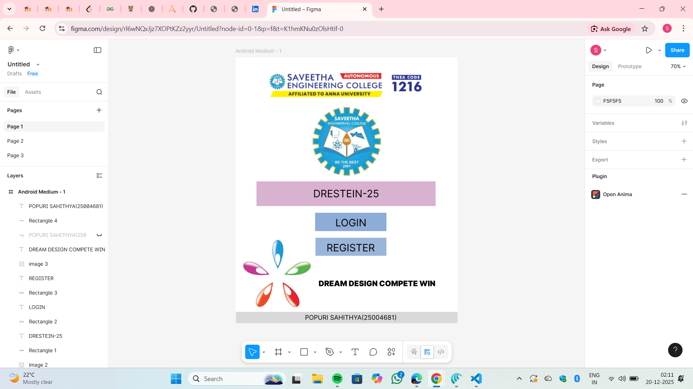
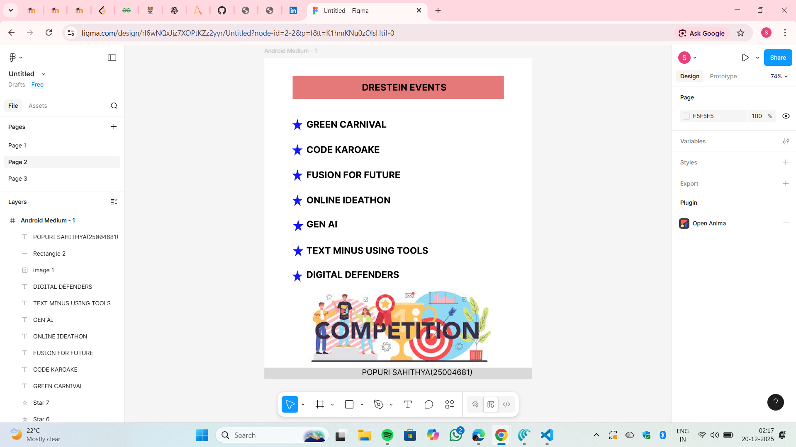
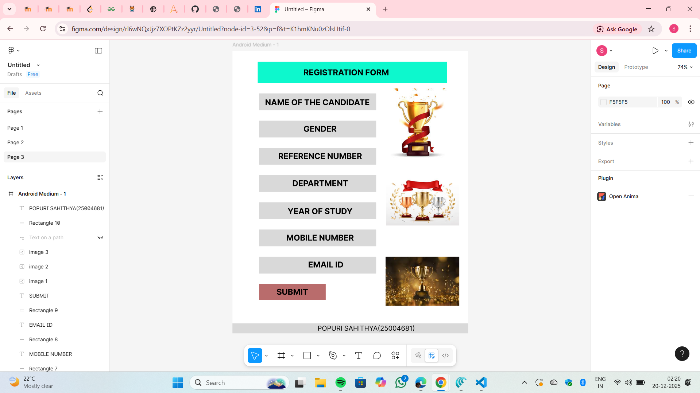

# Ex08 Event Registration Web Application
## Date:20/12/2025

## AIM:
To design, develop and deploy a web application for event registration using Figma UI tool.

## UI DESIGN TOOL:
Figma

## DESIGN STEPS:

### Step 1:
Use frames to represent screens or sections.

### Step 2:
Add column grids for consistent spacing and alignment.

### Step 3:
Insert shapes, text, buttons, and icons.

### Step 4:
Use Auto Layout for flexible, responsive design.

### Step 5:
Define color, text, and effect styles globally for consistency.

### Step 6:
Name layers logically and group related elements.

### Step 6:
Link frames to show navigation or interactions.

### Step 7:
Select the specific frame while generating code using Anima plugin.

## CODE:
```
Page 1

index.html
<!DOCTYPE html>
<html>
  <head>
    <meta name="viewport" content="width=device-width, initial-scale=1" />
    <meta charset="utf-8" />
    <link rel="stylesheet" href="globals.css" />
    <link rel="stylesheet" href="style.css" />
  </head>
  <body>
    <div class="android-medium">
      
      
      <div class="rectangle"></div>
      <div class="text-wrapper">DRESTEIN-25</div>
      <div class="div"></div>
      <div class="text-wrapper-2">LOGIN</div>
      <div class="rectangle-2"></div>
      <div class="text-wrapper-3">REGISTER</div>
      
      <div class="text-wrapper-4">DREAM DESIGN COMPETE WIN</div>
      <div class="rectangle-3"></div>
      <div class="text-wrapper-5">POPURI SAHITHYA(25004681)</div>
    </div>
  </body>
</html>

globals.css

@import url("https://cdnjs.cloudflare.com/ajax/libs/meyer-reset/2.0/reset.min.css");
* {
  -webkit-font-smoothing: antialiased;
  box-sizing: border-box;
}
html,
body {
  margin: 0px;
  height: 100%;
}
/* a blue color as a generic focus style */
button:focus-visible {
  outline: 2px solid #4a90e2 !important;
  outline: -webkit-focus-ring-color auto 5px !important;
}
a {
  text-decoration: none;
}

style.css

.android-medium {
  background-color: #ffffff;
  overflow: hidden;
  width: 100%;
  min-width: 700px;
  min-height: 840px;
  position: relative;
}

.android-medium .image {
  top: 34px;
  left: 93px;
  width: 516px;
  height: 106px;
  aspect-ratio: 4.87;
  position: absolute;
  object-fit: cover;
}

.android-medium .img {
  top: 153px;
  left: 238px;
  width: 225px;
  height: 225px;
  aspect-ratio: 1;
  position: absolute;
  object-fit: cover;
}

.android-medium .rectangle {
  position: absolute;
  top: 392px;
  left: 66px;
  width: 565px;
  height: 78px;
  background-color: #d7b2cf;
}

.android-medium .text-wrapper {
  position: absolute;
  top: 411px;
  left: 245px;
  font-family: "Inter-Regular", Helvetica;
  font-weight: 400;
  color: #000000;
  font-size: 32px;
  letter-spacing: 0;
  line-height: normal;
}

.android-medium .div {
  position: absolute;
  top: 491px;
  left: 251px;
  width: 225px;
  height: 58px;
  background-color: #8dabd6;
}

.android-medium .text-wrapper-2 {
  position: absolute;
  top: 503px;
  left: 315px;
  font-family: "Inter-Regular", Helvetica;
  font-weight: 400;
  color: #000000;
  font-size: 32px;
  letter-spacing: 0;
  line-height: normal;
}

.android-medium .rectangle-2 {
  position: absolute;
  top: 570px;
  left: 252px;
  width: 224px;
  height: 57px;
  background-color: #99b4d8;
}

.android-medium .text-wrapper-3 {
  position: absolute;
  top: 582px;
  left: 287px;
  font-family: "Inter-Regular", Helvetica;
  font-weight: 400;
  color: #000000;
  font-size: 32px;
  letter-spacing: 0;
  line-height: normal;
}

.android-medium .image-2 {
  top: 570px;
  left: 20px;
  width: 225px;
  height: 224px;
  aspect-ratio: 1;
  position: absolute;
  object-fit: cover;
}

.android-medium .text-wrapper-4 {
  position: absolute;
  top: 700px;
  left: 262px;
  width: 397px;
  font-family: "Inter-Black", Helvetica;
  font-weight: 900;
  color: #000000;
  font-size: 24px;
  letter-spacing: 0;
  line-height: normal;
}

.android-medium .rectangle-3 {
  position: absolute;
  top: 804px;
  left: 1px;
  width: 700px;
  height: 36px;
  background-color: #d9d9d9;
}

.android-medium .text-wrapper-5 {
  position: absolute;
  top: 810px;
  left: 219px;
  font-family: "Inter-Regular", Helvetica;
  font-weight: 400;
  color: #000000;
  font-size: 20px;
  letter-spacing: 0;
  line-height: normal;
  white-space: nowrap;
}

Page 2

index.html

<!DOCTYPE html>
<html>
  <head>
    <meta name="viewport" content="width=device-width, initial-scale=1" />
    <meta charset="utf-8" />
    <link rel="stylesheet" href="globals.css" />
    <link rel="stylesheet" href="style.css" />
  </head>
  <body>
    <div class="android-medium">
      <div class="rectangle"></div>
      <div class="text-wrapper">DRESTEIN EVENTS</div>
      
      
      
      
      
      
      
      <div class="div">GREEN CARNIVAL</div>
      <div class="text-wrapper-2">CODE KAROAKE</div>
      <div class="text-wrapper-3">FUSION FOR FUTURE</div>
      <div class="text-wrapper-4">ONLINE IDEATHON</div>
      <div class="text-wrapper-5">GEN AI</div>
      <div class="text-wrapper-6">TEXT MINUS USING TOOLS</div>
      <div class="text-wrapper-7">DIGITAL DEFENDERS</div>
      
      <div class="rectangle-2"></div>
      <div class="text-wrapper-8">POPURI SAHITHYA(25004681)</div>
    </div>
  </body>
</html>

globals.css

@import url("https://cdnjs.cloudflare.com/ajax/libs/meyer-reset/2.0/reset.min.css");
* {
  -webkit-font-smoothing: antialiased;
  box-sizing: border-box;
}
html,
body {
  margin: 0px;
  height: 100%;
}
/* a blue color as a generic focus style */
button:focus-visible {
  outline: 2px solid #4a90e2 !important;
  outline: -webkit-focus-ring-color auto 5px !important;
}
a {
  text-decoration: none;
}

style.css

.android-medium {
  background-color: #ffffff;
  width: 100%;
  min-width: 700px;
  min-height: 840px;
  position: relative;
}

.android-medium .rectangle {
  position: absolute;
  top: 47px;
  left: 74px;
  width: 552px;
  height: 60px;
  background-color: #e57878;
}

.android-medium .text-wrapper {
  position: absolute;
  top: 62px;
  left: 255px;
  font-family: "Inter-Bold", Helvetica;
  font-weight: 700;
  color: #000000;
  font-size: 24px;
  letter-spacing: 0;
  line-height: normal;
}

.android-medium .star {
  top: 159px;
  left: 73px;
  position: absolute;
  width: 28px;
  height: 30px;
}

.android-medium .img {
  top: 225px;
  left: 73px;
  position: absolute;
  width: 28px;
  height: 30px;
}

.android-medium .star-2 {
  top: 291px;
  left: 73px;
  position: absolute;
  width: 28px;
  height: 30px;
}

.android-medium .star-3 {
  top: 357px;
  left: 73px;
  position: absolute;
  width: 28px;
  height: 30px;
}

.android-medium .star-4 {
  top: 423px;
  left: 75px;
  position: absolute;
  width: 28px;
  height: 30px;
}

.android-medium .star-5 {
  top: 489px;
  left: 75px;
  position: absolute;
  width: 28px;
  height: 30px;
}

.android-medium .star-6 {
  top: 555px;
  left: 73px;
  position: absolute;
  width: 28px;
  height: 30px;
}

.android-medium .div {
  position: absolute;
  top: 159px;
  left: 110px;
  width: 367px;
  font-family: "Inter-Bold", Helvetica;
  font-weight: 700;
  color: #000000;
  font-size: 24px;
  letter-spacing: 0;
  line-height: normal;
}

.android-medium .text-wrapper-2 {
  position: absolute;
  top: 225px;
  left: 110px;
  width: 367px;
  font-family: "Inter-Bold", Helvetica;
  font-weight: 700;
  color: #000000;
  font-size: 24px;
  letter-spacing: 0;
  line-height: normal;
}

.android-medium .text-wrapper-3 {
  position: absolute;
  top: 291px;
  left: 110px;
  width: 367px;
  font-family: "Inter-Bold", Helvetica;
  font-weight: 700;
  color: #000000;
  font-size: 24px;
  letter-spacing: 0;
  line-height: normal;
}

.android-medium .text-wrapper-4 {
  position: absolute;
  top: 357px;
  left: 110px;
  width: 367px;
  font-family: "Inter-Bold", Helvetica;
  font-weight: 700;
  color: #000000;
  font-size: 24px;
  letter-spacing: 0;
  line-height: normal;
}

.android-medium .text-wrapper-5 {
  position: absolute;
  top: 420px;
  left: 110px;
  width: 367px;
  font-family: "Inter-Bold", Helvetica;
  font-weight: 700;
  color: #000000;
  font-size: 24px;
  letter-spacing: 0;
  line-height: normal;
}

.android-medium .text-wrapper-6 {
  position: absolute;
  top: 489px;
  left: 110px;
  width: 367px;
  font-family: "Inter-Bold", Helvetica;
  font-weight: 700;
  color: #000000;
  font-size: 24px;
  letter-spacing: 0;
  line-height: normal;
}

.android-medium .text-wrapper-7 {
  position: absolute;
  top: 552px;
  left: 110px;
  width: 367px;
  font-family: "Inter-Bold", Helvetica;
  font-weight: 700;
  color: #000000;
  font-size: 24px;
  letter-spacing: 0;
  line-height: normal;
}

.android-medium .image {
  position: absolute;
  top: 601px;
  left: 103px;
  width: 498px;
  height: 217px;
  aspect-ratio: 2.3;
  object-fit: cover;
}

Page 3

index.html

<!DOCTYPE html>
<html>
  <head>
    <meta name="viewport" content="width=device-width, initial-scale=1" />
    <meta charset="utf-8" />
    <link rel="stylesheet" href="globals.css" />
    <link rel="stylesheet" href="style.css" />
  </head>
  <body>
    <div class="android-medium">
      <div class="rectangle"></div>
      <div class="text-wrapper">REGISTRATION FORM</div>
      <div class="div"></div>
      <div class="text-wrapper-2">NAME OF THE CANDIDATE</div>
      <div class="rectangle-2"></div>
      <div class="text-wrapper-3">GENDER</div>
      <div class="rectangle-3"></div>
      <div class="text-wrapper-4">REFERENCE NUMBER</div>
      <div class="rectangle-4"></div>
      <div class="text-wrapper-5">DEPARTMENT</div>
      <div class="rectangle-5"></div>
      <div class="text-wrapper-6">YEAR OF STUDY</div>
      <div class="rectangle-6"></div>
      <div class="text-wrapper-7">MOBILE NUMBER</div>
      <div class="rectangle-7"></div>
      <div class="text-wrapper-8">EMAIL ID</div>
      <div class="rectangle-8"></div>
      <div class="text-wrapper-9">SUBMIT</div>
      
      
      
    </div>
  </body>
</html>

globals.css

@import url("https://cdnjs.cloudflare.com/ajax/libs/meyer-reset/2.0/reset.min.css");
* {
  -webkit-font-smoothing: antialiased;
  box-sizing: border-box;
}
html,
body {
  margin: 0px;
  height: 100%;
}
/* a blue color as a generic focus style */
button:focus-visible {
  outline: 2px solid #4a90e2 !important;
  outline: -webkit-focus-ring-color auto 5px !important;
}
a {
  text-decoration: none;
}

style.css

.android-medium {
  background-color: #ffffff;
  width: 100%;
  min-width: 700px;
  min-height: 840px;
  position: relative;
}

.android-medium .rectangle {
  position: absolute;
  top: 32px;
  left: 75px;
  width: 563px;
  height: 63px;
  background-color: #0df8cd;
}

.android-medium .text-wrapper {
  position: absolute;
  top: 49px;
  left: 211px;
  font-family: "Inter-Bold", Helvetica;
  font-weight: 700;
  color: #000000;
  font-size: 24px;
  letter-spacing: 0;
  line-height: normal;
}

.android-medium .div {
  position: absolute;
  top: 126px;
  left: 79px;
  width: 348px;
  height: 50px;
  background-color: #d9d9d9;
}

.android-medium .text-wrapper-2 {
  position: absolute;
  top: 138px;
  left: 97px;
  font-family: "Inter-Bold", Helvetica;
  font-weight: 700;
  color: #000000;
  font-size: 24px;
  letter-spacing: 0;
  line-height: normal;
}

.android-medium .rectangle-2 {
  position: absolute;
  top: 207px;
  left: 79px;
  width: 348px;
  height: 50px;
  background-color: #d9d9d9;
}

.android-medium .text-wrapper-3 {
  position: absolute;
  top: 217px;
  left: 211px;
  font-family: "Inter-Bold", Helvetica;
  font-weight: 700;
  color: #000000;
  font-size: 24px;
  letter-spacing: 0;
  line-height: normal;
}

.android-medium .rectangle-3 {
  position: absolute;
  top: 288px;
  left: 79px;
  width: 348px;
  height: 50px;
  background-color: #d9d9d9;
}

.android-medium .text-wrapper-4 {
  position: absolute;
  top: 298px;
  left: 136px;
  font-family: "Inter-Bold", Helvetica;
  font-weight: 700;
  color: #000000;
  font-size: 24px;
  letter-spacing: 0;
  line-height: normal;
}

.android-medium .rectangle-4 {
  position: absolute;
  top: 369px;
  left: 79px;
  width: 348px;
  height: 50px;
  background-color: #d9d9d9;
}

.android-medium .text-wrapper-5 {
  position: absolute;
  top: 379px;
  left: 178px;
  font-family: "Inter-Bold", Helvetica;
  font-weight: 700;
  color: #000000;
  font-size: 24px;
  letter-spacing: 0;
  line-height: normal;
}

.android-medium .rectangle-5 {
  position: absolute;
  top: 450px;
  left: 79px;
  width: 348px;
  height: 50px;
  background-color: #d9d9d9;
}

.android-medium .text-wrapper-6 {
  position: absolute;
  top: 462px;
  left: 164px;
  font-family: "Inter-Bold", Helvetica;
  font-weight: 700;
  color: #000000;
  font-size: 24px;
  letter-spacing: 0;
  line-height: normal;
}

.android-medium .rectangle-6 {
  position: absolute;
  top: 531px;
  left: 79px;
  width: 348px;
  height: 50px;
  background-color: #d9d9d9;
}

.android-medium .text-wrapper-7 {
  position: absolute;
  top: 541px;
  left: 160px;
  font-family: "Inter-Bold", Helvetica;
  font-weight: 700;
  color: #000000;
  font-size: 24px;
  letter-spacing: 0;
  line-height: normal;
}

.android-medium .rectangle-7 {
  position: absolute;
  top: 612px;
  left: 79px;
  width: 348px;
  height: 50px;
  background-color: #d9d9d9;
}

.android-medium .text-wrapper-8 {
  position: absolute;
  top: 621px;
  left: 225px;
  font-family: "Inter-Bold", Helvetica;
  font-weight: 700;
  color: #000000;
  font-size: 24px;
  letter-spacing: 0;
  line-height: normal;
}

.android-medium .rectangle-8 {
  position: absolute;
  top: 693px;
  left: 79px;
  width: 198px;
  height: 48px;
  background-color: #b96c6c;
}

.android-medium .text-wrapper-9 {
  position: absolute;
  top: 702px;
  left: 131px;
  font-family: "Inter-Bold", Helvetica;
  font-weight: 700;
  color: #000000;
  font-size: 24px;
  letter-spacing: 0;
  line-height: normal;
}

.android-medium .image {
  top: 612px;
  left: 455px;
  width: 219px;
  height: 146px;
  aspect-ratio: 1.5;
  position: absolute;
  object-fit: cover;
}

.android-medium .img {
  top: 379px;
  left: 456px;
  width: 218px;
  height: 140px;
  aspect-ratio: 1.56;
  position: absolute;
  object-fit: cover;
}

.android-medium .image-2 {
  top: 110px;
  left: 438px;
  width: 225px;
  height: 225px;
  aspect-ratio: 1;
  position: absolute;
  object-fit: cover;
}
```

## OUTPUT:






## RESULT:
The program to design, develop and deploy a web application for event registration using Figma UI tool is completed successfully.
